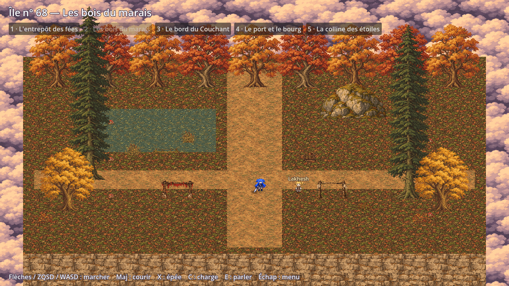
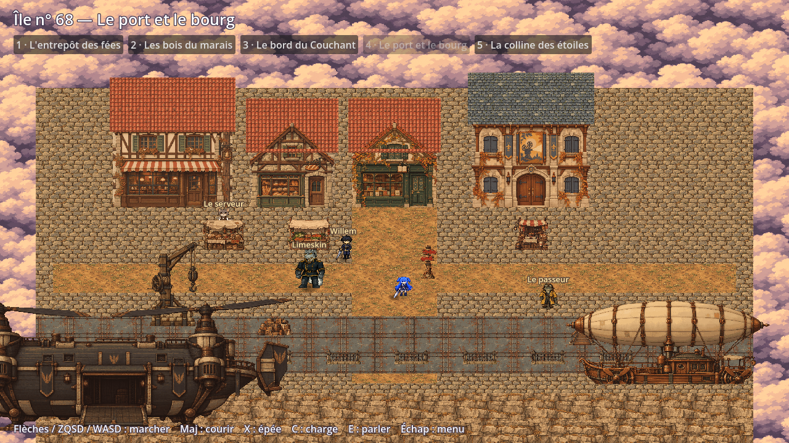

# Bibliothèque HD-2D livrée par priorité

Les quatre lots fournissent 316 PNG et 159 JSON d'animation : 52 personnages
avec portrait et trois vues, Timere dans les trois vues, 96 textures de décor
et 9 icônes d'objets. Les trois effets facultatifs restent produits par le jeu.

| Lot | PNG | JSON | Galerie autonome |
| --- | ---: | ---: | --- |
| Priorité 1 | 29 | 6 | [Ouvrir](PRIORITE_1_AUTONOME.html) |
| Priorité 2 | 82 | 21 | [Ouvrir](PRIORITE_2_AUTONOME.html) |
| Priorité 3 | 69 | 30 | [Ouvrir](PRIORITE_3_AUTONOME.html) |
| Priorité 4 | 136 | 102 | [Ouvrir](PRIORITE_4_AUTONOME.html) |

Ces HTML contiennent les images : ils s’affichent sans les dossiers du dépôt.
Les 316 PNG incorporés et téléchargés ont été vérifiés par SHA-256 dans un
navigateur, avec seulement le fichier HTML disponible. Les galeries relatives
restent incluses dans les ZIP entièrement extraits.

Voir [l’aperçu des corrections](CORRECTIONS_ASSETS.html) pour les poses reprises,
les détails de la bible, les deux îles nettoyées et l’enduit répété.

Les sept combattants sont Chtholly, Willem, Ithea, Nephren, Nopht, Rhantolk et
Lillia. Ils ont repos, marche, course, attaque, charge, dégâts et chute ; Ithea
et Nephren ajoutent le dialogue. Les 45 autres personnages ont repos, marche,
course et dialogue. Timere a repos, marche, course, fouet, morsure, dégâts et
mort. Toutes ces animations existent de face, de dos et de profil droit ;
le profil gauche est son miroir. Les JSON décrivent de vrais dessins découpés.

Les poses fusionnées ou manquantes ont été remplacées par des dessins distincts
et leurs sources conservées. La bibliothèque se charge dans Godot : 52/52
personnages et Timere, 20 308 contrôles, aucun échec. Ce contrôle porte sur les
fichiers, les orientations, tous les frames, les cadences, les rectangles et
les marqueurs de combat. Les ancres calculées et la fluidité des cycles restent
à revoir visuellement ; les indicateurs de validation artistique restent faux.

Chaque lot passe son contrôle de dimensions, alpha, atlas, poids et raccords.
La bibliothèque complète dépasse le budget de 25 Mo prévu pour le jeu, tandis
que l'export Web contient les personnages utilisés dans les scènes. Le contrôle
global des PNG continue de signaler ce dépassement ; les résultats de lot ne
le masquent pas. Les archives de lots sont des ressources à intégrer, pas des
exports complets de l'application.

```sh
python tools/sukasuka2d/prepare_delivery.py
python tools/sukasuka2d/make_resources.py --activate-pixel-skins
tools/godot --headless --script tools/hd2d_library_check.gd
python tools/sukasuka2d/make_priority_package.py --priority 2
python tools/sukasuka2d/make_priority_package.py --priority 3
python tools/sukasuka2d/make_priority_package.py --priority 4
```

Les manifestes par priorité et `assets/source/resumed_2d/delivery_validation.json`
donnent les comptes exacts. Les sources natives sont sous
`assets/source/resumed_2d/pixel/`. Les dessins anime précédents sont accessibles
dans [l'atelier complet](ATELIER_2D.html), sans changement des onze originaux.




