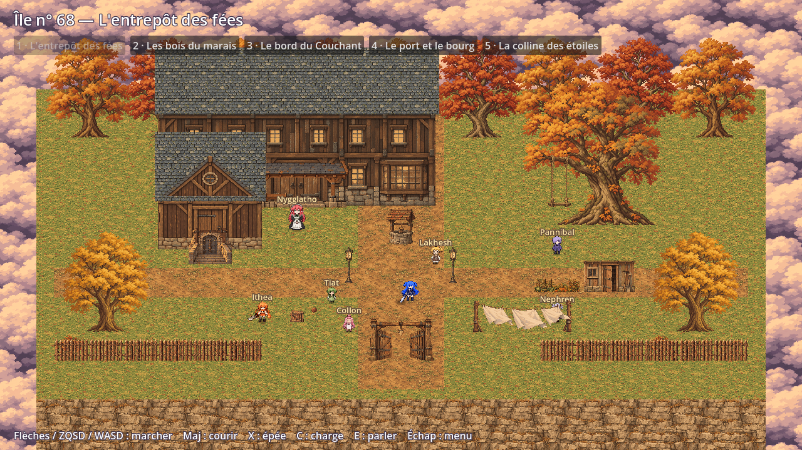
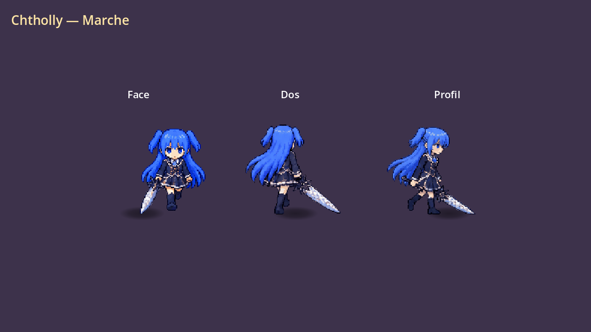

# Livraison HD-2D — priorité 1, 8 octobre 2026

Le lot reprend les lignes de priorité 1 du cahier `ASSETS_HD2D.md`, avec les
vues de face et de dos demandées en complément du profil droit. Le profil
gauche est le miroir du droit. Les personnages supplémentaires générés restent
dans le projet ; leur priorité n'est pas assimilée à celle du document.

29 PNG : 3 atlas et un portrait de Chtholly, 3 atlas de Timere, 4 sols,
4 façades, 2 matières de bâtiment et 12 panneaux d'accessoires.
Les sept animations de chaque combattant ont leurs vrais dessins découpés,
leurs rectangles, cadence, boucle et déclencheurs dans six JSON adjacents.
Repos : Chtholly 144 px ; Timere 99 px. Portrait : 256 × 256 px.

Les natifs générés avec `image_gen` sont conservés. La préparation utilise
un redimensionnement au plus proche voisin, un alpha binaire, une palette
limitée sans tramage et des gouttières transparentes de 4 px. Le bord opposé
des textures répétées est aligné sur un pixel ; le contrôle des pixels aux
bords ne remplace pas une inspection du motif répété dans le décor.

## Utilisation

Décompresser le ZIP puis ouvrir `docs/sprites/PRIORITE_1.html` pour consulter
et télécharger les images séparément. Copier les dossiers de textures et les
JSON dans le projet en conservant leurs chemins. Les JSON utilisent le format
`images: [x, y, largeur, hauteur, ancre_x, ancre_y]` du cahier.

Dans ce dépôt, **Découvrir l’île n° 68** ouvre une promenade HD-2D depuis le
menu. Son décor utilise aussi des assets des lots suivants déjà disponibles.
La cour présente les sols, bâtiments et panneaux du premier lot.

```sh
python tools/hd2d_assets.py --manifest tools/hd2d_priority1_manifest.json check
python tools/sukasuka2d/make_priority1_package.py
```

## Contrôles et limites

Le contrôle technique vérifie 29/29 images, leurs dimensions, le mode RGBA,
l'alpha 0/255, les rangées, les comptes d'images, les cadences et les rectangles
JSON. Les PNG de ce lot pèsent 7,1 Mo au total, chacun moins de 1 Mo.
Le ZIP contient aussi les natifs ; sa taille est donc supérieure.

Les ancres sont calculées depuis le bas des silhouettes. Une revue visuelle
des pieds et des cycles reste nécessaire avant de figer les animations de jeu ;
`anchors_validated` et `combat_timing_validated` restent explicitement faux.
Les dessins anime précédents restent dans `ATELIER_2D.html` et leurs archives.
Les scans officiels ne sont pas distribués dans ce paquet.

Vérification Godot du lot : 80 contrôles headless réussis, dont trois vues,
sept clips, horloge des animations, fenêtres de coup, onde, miroir gauche et
densité de 96 px/m. Galerie : 29 images chargées, 29 téléchargements accessibles,
filtres vérifiés, aucune erreur navigateur et aucun débordement à 390 px.
Les onze PNG anime initiaux correspondent toujours à leurs SHA-256 archivés.

Aperçus capturés dans Godot, avec les textures du projet :




